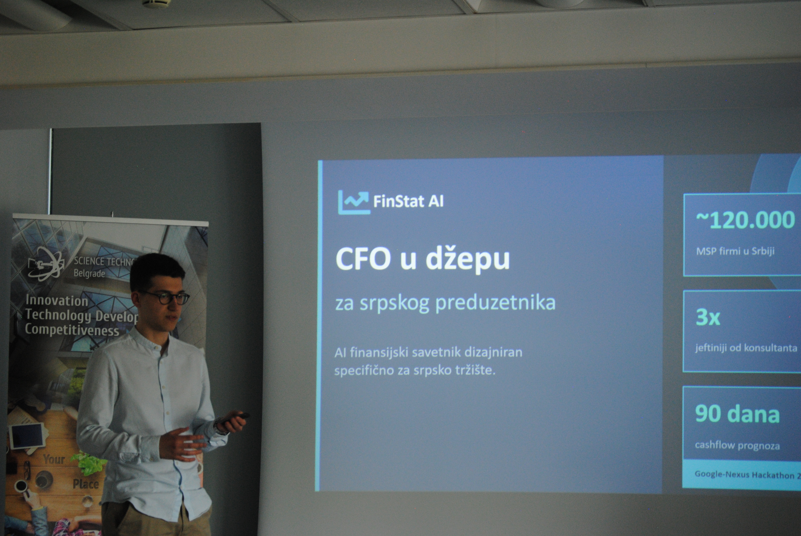
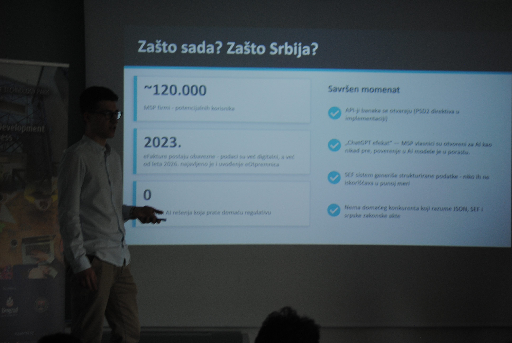
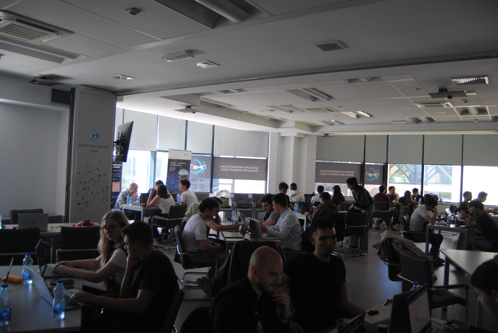

# FinStat AI — CFO in Your Pocket for Serbian Entrepreneurs

> **Google Nexus Hackathon 2026** · AI/ML Solutions for Real-World Impact  
> Proof of Concept · April 2026

---

## Problem

Small and medium business owners in Serbia are simultaneously CEO, CFO, and legal team — without ERP systems or dedicated staff to handle finances, accounting, and regulatory compliance.

- **Financial fog** — bank balance is visible, but cashflow, risks, and trends stay under the radar
- **Regulatory jungle** — e-invoices, VAT, labor law keep changing; legal advisors are expensive
- **Missed opportunities** — billions of dinars in grants and subsidies go unnoticed

~120,000 SMEs in Serbia: too complex for Excel, too small for SAP.  
**No one is serving them directly.**



---

## Solution

An end-to-end platform with two outputs:

```
INPUTS                   AI Engine                 OUTPUTS
──────                   ─────────                 ───────
Bank account      →    Database          →    Dashboard
e-Invoices        →    NLP analysis      →    AI Chatbot
Legal legislation →    Forecasting
                         Regulatory checks
```

### Dashboard
- Complete financial analytics and visualization
- 90-day cashflow forecast powered by ML
- Real-time alerts and recommendations

### AI Chatbot
- Financial and legal advisor tailored to the Serbian market
- Quarterly reports on demand
- Business strategy and growth planning

---

## Why Now? Why Serbia?

| | |
|---|---|
| **120,000** | SMEs - potential users |
| **2023** | e-Invoices became mandatory - data is already digital |
| **0** | local AI solutions tracking domestic regulation |
| **Summer 2026** | e-Delivery notes rollout announced |

PSD2 directive is opening up banking APIs. The SEF system generates structured data that nobody is fully utilizing. No domestic competitor understands JSON, SEF, and Serbian legal acts simultaneously.


---

## Business Model (SaaS)

| Plan | Price | Target |
|------|-------|--------|
| Starter | €29/mo | Early-stage entrepreneur |
| **Pro** ⭐ | **€69/mo** | Companies with 5–50 employees |
| Agency | €199/mo | Accountants & holding companies |

Alternative cost: consultant ~€3,200/yr · lawyer ~€800/yr · missed grant ~€5,000+  
→ Pro plan saves up to 60% of that value.

---

## Roadmap

| Phase | Timeline | What |
|-------|----------|------|
| ✅ MVP | Hackathon → Q2 2026 | Bank API (JSON), e-Invoices (JSON), Dashboard, AI Chatbot |
| Phase 2 | Q2–Q3 2026 | PDF legal acts, regulatory database, legal Q&A, alerts |
| Phase 3 | Q4 2026 | SEF integration, emails, grants & subsidies tracker |

---

## Materials

- 📊 [`presentation/FinStat_AI_pitch.pptx`](presentation/FinStat_AI_pitch_git_vs.pptx) — pitch deck
- 🎥 [`demo/FinStat_video.mp4`](demo/FinStat_video.mp4) — system demo
- 🖼️ [`assets/`](assets/) — photos from the pitch defense

---

## Team

Built at **Google Nexus Hackathon 2026**.

- [Stefan Branković](https://github.com/stefbrankovic) - system design, data pipeline, pitch presentation
- [Dobrica Janković](https://github.com/dobricaJankovic) - system design, data pipeline
- [Ilija Trajković](https://github.com/Trajko03) - system design, data pipeline
- [Mihajlo Stevanović](https://github.com/MihStev) - system design, data pipeline



---

## Tech Stack

`Python` · `REST APIs` · `JSON` · `NLP` · `ML (cashflow forecasting)` · `Dashboard`
